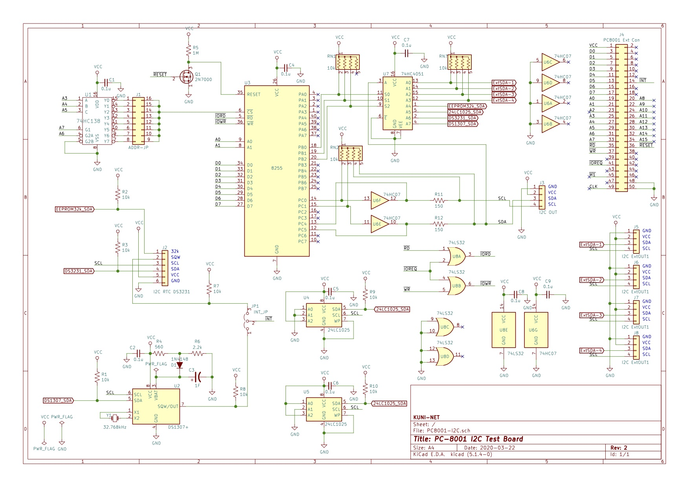

= PC-8001用 8255PPIによるI2CボードのKiCADデータ

== 概要
* PC-8001用 8255PPIによるI2CボードのKiCADデータです
** 8255PPIのポートC PC0、PC4を使用してI2C通信を実施します。PC0-3、PC4-7の入出力設定を頻繁に切り替えるため別の用途で使用する場合は注意が必要です。

== I/Oアドレス
* PC-8001のI/Oアドレスのうち以下を選択可能です。
** $80,

== 参考
* 74HC4066のシンボルなどは、以下のリポジトリでMuSAさんが公開されているものを使用しています。
** https://github.com/musa/kicad-library